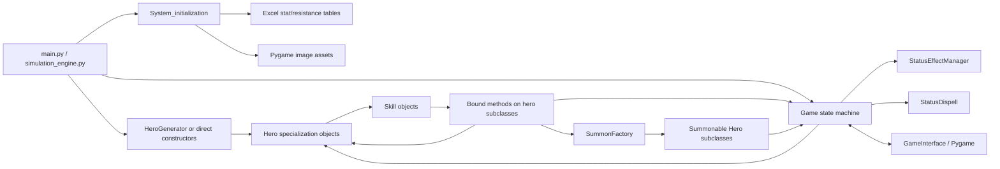
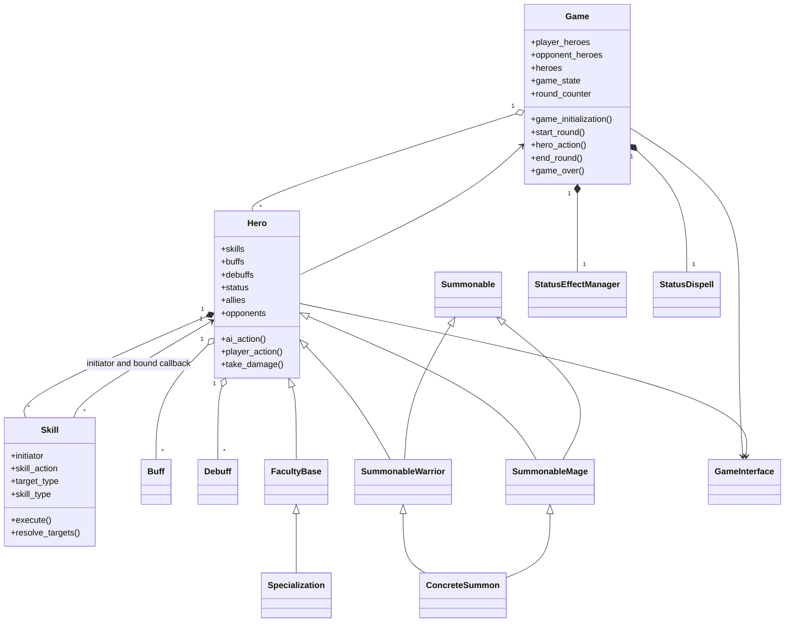
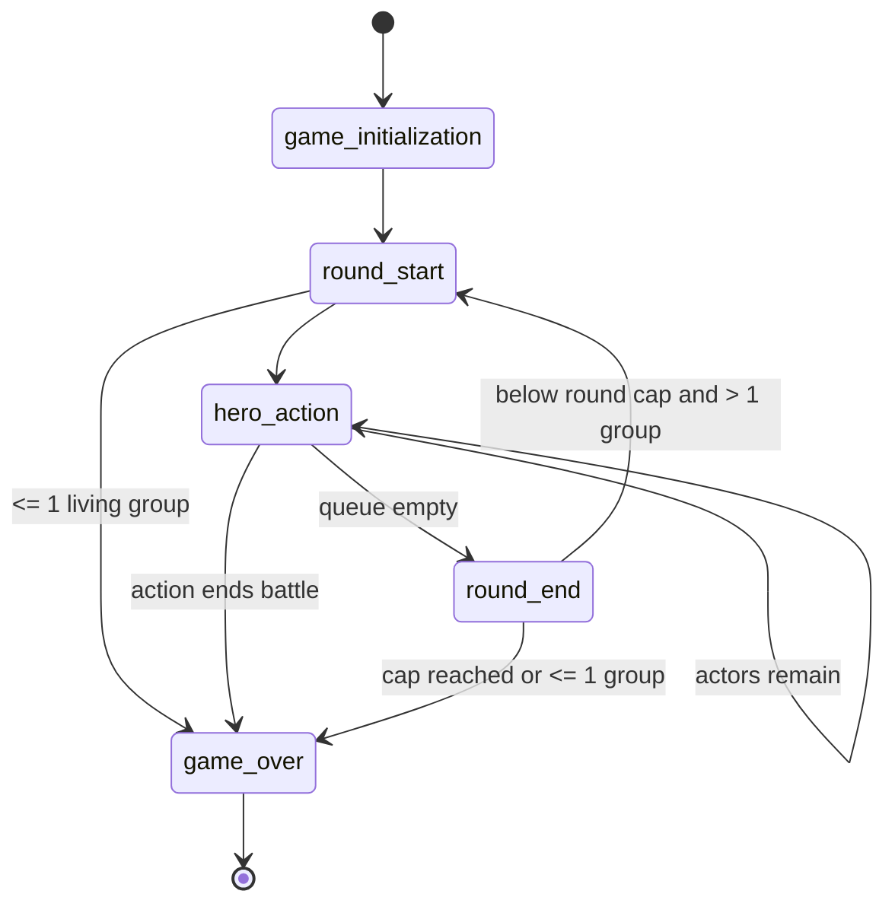
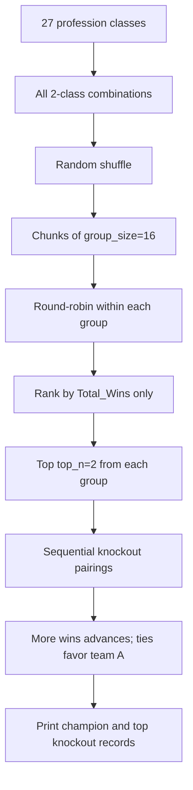

# Engine Architecture

## Architectural centre

The current engine is an in-process mutable object graph. `Game` owns team and
turn collections and orchestrates phases. Every `Hero` owns its statistics,
status flags and counters, skills, AI state, and references back to its `Game`
and interface. A `Skill` stores metadata plus a bound hero method and performs
generic target filtering before invoking that method.



Evidence: `game/game.py:21-45`; `heroes/hero.py:109-281`;
`skills/skill.py:15-35`; `system/system_initialization.py:7-75`.

## Main modules and responsibilities

| Module | Responsibility actually present |
|---|---|
| `game/game.py` | Battle setup, group membership, round/turn state machine, cooldown/status dispatch, win detection, messages and UI notification |
| `heroes/hero.py` | Base entity state, randomized property/resistance creation, damage/healing/death rules, skill selection and target selection, default AI/player actions |
| `skills/skill.py` | Skill metadata, target normalization, death/evasion/immunity gates, casting/cooldown special cases, dispatch to hero skill methods |
| `game/status_effect_manager.py` | One large round-start dispatcher for each named status, including damage/healing ticks, duration changes, stat restoration, casting resolution, and summon duration |
| `game/status_dispell.py` | Type-aware removal/restoration logic for dispellable status names |
| `heroes/<faculty>.py` | Concrete specialization construction, skill effect calculations, status application, and selected specialization-specific AI |
| `heroes/summon_unit.py` | Summon mixins/classes, summon-specific skills and AI |
| `heroes/summon_factory.py` | String-to-summon-class factory |
| `game/hero_generator.py` | Class catalogue, random names/classes, construction |
| `system/system_initialization.py` | Loads balance tables and Pygame icon surfaces |
| `system/game_interface.py` | Window layout, logs, hero panels, keyboard event loops, skill/target selection |
| `simulation_engine.py` | Repeated battle drivers, aggregation, team combination generation, and 2v2 tournament stages |

## Core classes and relationships



`FacultyBase` represents `Warrior`, `Mage`, `Paladin`, `Priest`, `Rogue`,
`Necromancer`, `Warlock`, and `Death_Knight`. Concrete specializations inherit
one of them. Summons use multiple inheritance: for example,
`SummonableWarrior(Warrior, Summonable)` and
`SummonableMage(Mage_Summon, Summonable)`
(`heroes/summon_unit.py:17-53`).

`Buff` and `Debuff` are records (`name`, `duration`, `initiator`, `effect`,
`type`) rather than polymorphic effect objects (`skills/skill.py:408-421`).
Most effect state also lives in named attributes and boolean status keys on
`Hero`.

## Battle lifecycle

Both `main.py` and each simulator contain an external dispatcher over five
string states:



1. `Game.__init__` concatenates initial teams into `heroes`, constructs status
   helpers, and sets `game_state = "game_initialization"`
   (`game/game.py:23-44`).
2. `game_initialization()` injects `Game` and interface references into heroes,
   creates a group map, refreshes ally/opponent lists, prints rosters, and
   transitions to `round_start` (`game/game.py:189-206`).
3. The caller repeatedly invokes the method matching `game_state`.
4. `game_over()` reports a surviving group, mutual defeat, or round-cap result.
   It does not set a separate result object (`game/game.py:345-359`).

The older monolithic `play_game()` remains inside a triple-quoted block
(`game/game.py:360-463`) and is not active.

## Round lifecycle

`start_round()`:

1. emits the round header and current HP;
2. removes defeated summoned units from the two team lists;
3. refreshes `allies`, `allies_self_excluded`, and `opponents`;
4. decrements active skill cooldowns;
5. calls `StatusEffectManager.check_heroes_status_effects()` once per hero;
6. checks for battle end;
7. removes defeated heroes from `Game.heroes`;
8. sorts living heroes by descending current agility and copies that list to
   `unactioned_sorted_heroes`;
9. transitions to `hero_action`.

Evidence: `game/game.py:208-251`. Status effects therefore tick before action
order is captured. Status mutations can kill heroes or modify agility before
the sort.

`end_round()` increments the counter, resets every remaining hero's `actioned`
flag, and either starts another round or ends the game
(`game/game.py:337-343`). Because the check is `round_counter >= 15` after
incrementing, round 14 is the last action round under normal progression.

## Turn and skill execution lifecycle

```mermaid
sequenceDiagram
    participant Caller as Entry-point loop
    participant G as Game
    participant H as Acting Hero
    participant UI as GameInterface
    participant S as Skill
    participant T as Target Hero

    Caller->>G: hero_action()
    G->>G: pop fastest unactioned hero
    G->>G: refresh allies/opponents
    alt insanity or scoff
        G->>H: ai_action(remapped/forced sides)
    else player-controlled
        H->>UI: select_skill(...)
        UI-->>H: chosen Skill
        H->>UI: select_target(...)
        UI-->>H: target(s)
        H->>S: execute(targets)
    else AI-controlled
        H->>H: ai_choose_skill(opponents, allies)
        H->>H: ai_choose_target(skill, opponents, allies)
        H->>S: execute(targets)
    end
    S->>S: resolve_targets()
    S->>S: death/evasion/immunity checks
    S->>H: invoke bound skill_action(...)
    H->>T: mutate HP/stats/status collections
    H->>G: emit battle log / possibly add summon
    G->>G: check living groups; mark actor actioned
```

The default AI selects an available non-cooling skill randomly and then chooses
targets based on `skill_type`, `target_type`, and health ordering
(`heroes/hero.py:852-864, 1074-1169`). Several specializations override this
with `battle_analysis()` strategy weights—for example
`Warrior_Comprehensiveness` (`heroes/warrior.py:119-211`),
`Priest_Discipline` (`heroes/priest.py:375-561`), and
`Necromancer_Necromancy` (`heroes/necromancer.py:124-242`). Many other
specializations inherit the random default.

`Skill.execute()` is not a thin command. It contains generic gates plus
skill-name-specific behavior for casting, cooldowns, secondary buffs, and
special targeting (`skills/skill.py:119-406`). Concrete bound methods in hero
modules calculate damage/healing and create or refresh status records. This
splits a single skill's rule across `Skill.execute`, a hero method, `Hero`
damage/death handling, and the status manager.

## Manual flow

`main.py` builds the UI and registers it as an observer, but the observer
interface is used inconsistently: `Game.notify_observers()` calls
`update_display`, while most display methods directly call `add_log()` and
`update_all_display()` (`game/game.py:54-61, 131-186`).

For a player-controlled hero:

1. `Game.hero_action()` calls `Hero.player_action()`.
2. `player_choose_skill()` filters cooldown skills and delegates to
   `hero.interface.select_skill()` (`heroes/hero.py:865-908`).
3. `player_choose_target()` determines a target pool and delegates to
   `interface.select_target()` (`heroes/hero.py:909-1072`).
4. `Skill.execute()` performs the action.

`GameInterface.select_skill()` and `select_target()` run their own blocking
Pygame event loops (`system/game_interface.py:355-474`). The outer loop still
ticks at 60 FPS (`main.py:79-105`), so presentation pacing is partly in the
engine (`time.sleep` in `Game.display_*`) and partly in the interface.

## Automated and simulation flow

AI-controlled turns remain synchronous and use the same mutable `Skill` and
hero methods. In `simulation` mode, `Game.display_*` suppresses printing and
delays, but still appends some messages to `output_buffer`
(`game/game.py:123-187`). No interface is passed, but
`pass_interface_to_heroes()` still assigns `None`.

The simulation drivers duplicate the state dispatch loop for 1v1, 2v2, and 3v3
(`simulation_engine.py:42-60, 313-324, 509-521`). Outcome is inferred from
`check_groups_status()` after the loop.

### Tournament flow

The active 2v2 tournament is:



Evidence: `simulation_engine.py:338-482`. `parallel` is stored but unused;
`Pool` and `cpu_count` are imported but unused. The random group shuffle and
unseeded combat make rankings non-reproducible.

## Summoning

Summon skills call `SummonFactory.create_summon()` using a string key. The
factory returns one of five concrete classes or raises `ValueError`
(`heroes/summon_factory.py:4-26`). Summon methods:

- reject or replace based on the master's `summoned_unit`;
- construct the summon with master, group, duration, and shared
  `System_initialization`;
- assign the summon to the master;
- inject the current game;
- append it to the appropriate team list, `Game.heroes`, and the current
  unactioned queue.

Examples: `heroes/mage.py:84-113`, `heroes/necromancer.py:35-64`,
`heroes/warlock.py:74-102`. Appending to the unactioned queue is why a newly
summoned unit can act in its creation round. Master death sets the summon HP to
zero; summon death clears the master's pointer (`heroes/hero.py:533-551`).
Duration is checked centrally in the status manager
(`game/status_effect_manager.py:303-324`).

## Status architecture

Status state is deliberately explicit but distributed:

- a per-instance copy of roughly 69 boolean flags;
- dozens of duration, stack, accumulated-delta, and damage fields on `Hero`;
- `Buff`/`Debuff` lists and a recycle pool;
- named dictionaries for healing and resistance modifiers;
- application logic in hero skill methods and parts of `Skill.execute`;
- round processing in a roughly 970-line conditional dispatcher;
- separate dispel reversal logic.

This supports many bespoke interactions, but correctness depends on exact
agreement among string names and multiple pieces of mutable state. One concrete
example of this risk is the missing comma between `'stitch_of_agony'` and
`'shadow_word_insanity'` in `Hero.list_status_debuff_magic`
(`heroes/hero.py:95-97`), which concatenates them into one string at runtime.

## Dependencies and dependency risks

### Confirmed import cycles

`heroes/__init__.py` imports `Hero` and every concrete hero module. At the same
time, `heroes/hero.py` and most concrete hero modules execute
`from heroes import *`. `skills/skill.py` also imports both `heroes` and
`skills`, while hero modules import `skills`. Python's package initialization
order currently permits the observed imports, but this is a real circular
dependency surface.

`game/hero_generator.py` imports `Game` even though it does not use it, while
`Game` wildcard-imports `heroes` and `skills`. Backup modules repeat earlier
structures and can confuse static analysis, although active imports do not
select them.

### Tight coupling and duplicated responsibility

- Heroes require a fully initialized object containing pandas DataFrames; they
  cannot be constructed from plain battle data.
- `System_initialization` combines game data loading and graphical asset
  creation. Even simulation therefore initializes Pygame.
- `Hero` references `Game` and `GameInterface`; hero skills call game display
  methods directly.
- `Game` contains display delays, ANSI formatting, logs, observer calls, and
  rules.
- `Skill.execute()` branches on human-readable skill names, while concrete hero
  methods and the status manager own other parts of those same skills.
- AI analysis is duplicated in several specializations and otherwise defaults
  to random selection.
- Each simulator duplicates battle state dispatch and outcome inference.
- Lists (`player_heroes`, `opponent_heroes`, `heroes`, action queues, allies)
  contain overlapping views that must be manually synchronized.

## Strengths of the current architecture

1. Manual and automated modes execute the same battle-state transitions and
   domain methods, limiting rule divergence between those modes.
2. The five-state lifecycle is explicit and can be stepped incrementally.
3. The base/faculty/specialization hierarchy makes the available roster easy to
   locate, and each constructor exposes its three-skill kit.
4. `Skill` centralizes important hit validation (dead, evasion, immunity) and
   callback dispatch.
5. External Excel ranges make core hero statistics tunable without editing
   Python; simulation drivers already exercise many matchup combinations.
6. Summons reuse hero turn, targeting, skill, and status behavior instead of
   introducing a wholly separate entity path.

## Engine versus presentation responsibilities

Confirmed engine responsibilities include state transitions, action order,
target legality, AI decisions, cooldowns, casting, hit checks, damage/healing,
status effects, summons, and victory checks.

Confirmed presentation responsibilities include window layout, fonts/colors,
icon display, log rendering, and keyboard input. However, the boundary is not
clean: engine classes produce ANSI-formatted prose, sleep for pacing, directly
invoke UI methods, and expose live objects to the UI. Conversely, manual target
selection logic is split between `Hero` and `GameInterface`.

## Initial Godot-readiness assessment

The battle loop's explicit states and shared simulation path are useful
foundations for a future authoritative Python service. The current code does
not yet expose that authority through a stable boundary:

- no command/event schema or state snapshot serializer was found;
- no stable hero/skill/status identifiers distinct from display strings were
  found;
- no deterministic RNG ownership or replay mechanism was found;
- calls are synchronous and sometimes blocking;
- Pygame, pandas, filesystem paths, and presentation callbacks are reachable
  from domain construction/execution;
- state is a large cyclic object graph with bound methods, back-references, and
  duplicated collections;
- no network or multiplayer concurrency model exists.

Therefore the rules are demonstrably executable without manual input, but the
repository is not directly ready to connect to Godot as an authoritative,
serializable engine. This is an assessment of the present boundary, not a
  redesign proposal.
